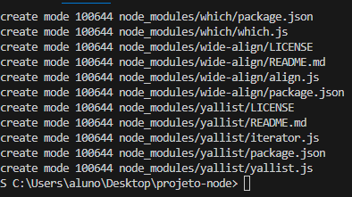
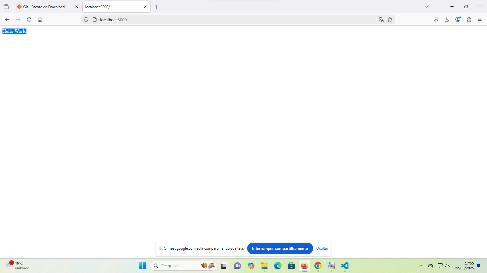

instalei npm init também o node.js, coloquei os comando git, como os comandos

Veja o exmeplo funcionando:

eu criei um repositorio projeto-node-web-1
e inclui o repositorio remoto no meu projeto

git remote add origin https://github.com/Adalguily/projeto-node-web-1.git

o comando acima faz associar um repositório local a um repositório remoto.

git branch -M main, esse comando criar uma branch chamada "main", branch(ou seja, branches seria uma especie de ramificações designar ramos de trabalhos)

git push -u origin main este sicroniza o repositório remoto com o repositório local, sempre irei fazer isso quando tiver "coisas novas" no código quando sincronizar com repositório remoto

o API REST define como as aplicações se comunicam entre si. Em APIs REST, as informações são sempre processadas e manipuladas no backend. O front-end envia uma solicitação (requisição) para o backend, que, por sua vez, executa as operações necessárias, como acessar um banco de dados, processar dados, ou realizar cálculos. A resposta do backend é então enviada de volta para o front-end.

Vamos iniciar a integração com o banco de dados Knex.

o comando npm install knex sqlite3, instala o knex

coloquei um arquivo knexfile.js e coloquei uma programação nele, que estava descrito no pdf, la constava client, connection, filename: meu banco
e uso de algo nulo como verdadeiro

tive que remover a pasta node modules, que deu problema no github e utilizei esse comando para tirar a pasta:

git rm -r --cached node_modules

o foi criado o arquivo gitignore, este serve para colocar os arquivos no historico do node modules 

foi adicionado a programação de tabela usuarios que consta id, nome, email, senha e mostra Tabela Criada

foi colocado um insert da tabela anterior e onde o usuario coloca suas informaçoes e depois será confirmado que foi inserido

consulta de dados 
mostra ao usuario como ele colocou os seus dados

filtrando dados
mostra como ele colocou o seu email e nome como link de acesso aos seus dados

atualizando dados
este reintegrar qualquer modificação feita pelo usuario para atualizar qualquer mudança feita por ele

remoção de dados
este caso o usuario queira excluir algo este faz a remoção

finalizando a conexão com o banco

este encerra as ações feitas pelo usuario, quando completada

no db.js faz o require, que server para importar módulos externos de um programa

no segundo ele monta a tabela com as informações do usuario para banco de dados

